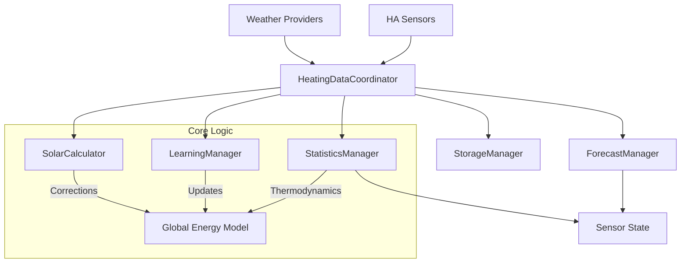

# Heating Analytics Design Documentation

> **Note:** This document outlines the architectural design and logical models of the Heating Analytics integration. It is intended for developers and system architects to understand the *why* and *how* behind the code.

## 1. Architectural Overview

The integration follows a **Coordinator-Manager** pattern to handle complexity and ensure separation of concerns. The system operates on a rigorous thermodynamic model rather than simple linear regression.

### Components

1.  **HeatingDataCoordinator (`coordinator.py`):**
    *   **Role:** The Central Nervous System.
    *   **Duty:** Orchestrates the 1-minute update loop, dispatches data to managers, and holds the canonical state (`self.data`).
    *   **Key Behavior:** Handles "Smart Merging" of data gaps (e.g., if HA restarts) using persisted snapshots.

2.  **StatisticsManager (`statistics.py`):**
    *   **Role:** The Physicist.
    *   **Duty:** Calculates thermodynamic power predictions, deviations, and efficiencies.
    *   **Key Innovation:** **Regime-Aware Prediction** (see below). It treats "Cold" days (physics-dominated) differently from "Mild" days (noise-dominated).

3.  **ForecastManager (`forecast.py`):**
    *   **Role:** The Oracle.
    *   **Duty:** Manages future predictions and "What If" scenarios.
    *   **Key Innovation:** **Shadow Forecasting**. It tracks the accuracy of multiple weather sources (Primary vs. Secondary) *simultaneously*, allowing users to validate a new weather provider without switching the active control logic.

4.  **LearningManager (`learning.py`):**
    *   **Role:** The Student.
    *   **Duty:** Updates the energy model based on observed performance.
    *   **Key Behavior:** Uses **Exponential Moving Average (EMA)** to gently adapt the model over time, preventing single-day anomalies from corrupting long-term stats. It also enforces **Purity Guards** (ignoring data during Guest Mode or mixed heating/cooling usage).

5.  **SolarCalculator (`solar.py`):**
    *   **Role:** The Astronomer.
    *   **Duty:** Calculates theoretical solar potential and learns the **Solar Coefficient** (how well the house captures that potential).

6.  **StorageManager (`storage.py`):**
    *   **Role:** The Librarian.
    *   **Duty:** Handles JSON persistence, schema migrations (e.g., HDD -> TDD), and backfilling missing metadata.
    *   **Data Lifecycle:** Manages the promotion of high-resolution `hourly_log` data into aggregated `daily_history` summaries. This ensures that while granular data (logs) is rotated (90 days), the statistical backbone (history) persists indefinitely (2 years).

---

## 2. Core Logic & Models

### A. Thermal Degree Days (TDD)
Unlike traditional systems that split Heating Degree Days (HDD) and Cooling Degree Days (CDD), this system uses a unified **Thermal Degree Day** metric.

*   **Formula:** `TDD = |Balance_Point - Effective_Temperature| / 24`
*   **Why:** A well-insulated house behaves symmetrically: deviation from the balance point requires energy, whether it's heating or cooling. This allows a single continuous model curve.

### B. Inertia & Effective Temperature
Buildings do not react instantly to outside air temperature. The system calculates an **Effective Temperature** using a weighted history (Inertia). This value is exposed via the **Thermal State Sensor** for external automations.

*   **Default Profile (Thermal Mass Balanced):**
    *   Current Hour: 20%
    *   T-1 Hour: 30%
    *   T-2 Hours: 30%
    *   T-3 Hours: 20%
    *   **Logic:** Symmetric arc profile. The middle hours (H-1, H-2) carry the most weight, reflecting that a well-insulated house's heating demand correlates most with the 1-3 hour temperature trend.
*   **Design Rule:** `NEVER` use future data (forecasts) to calculate inertia for the past. This prevents data leakage in the learning model.

### C. Regime-Aware Prediction
The system changes its prediction strategy based on the severity of the weather ("Regimes").

1.  **Cold Regime (TDD > 4.0):**
    *   **Physics Dominates:** Heat loss is linear and predictable.
    *   **Strategy:** If a specific wind/temp bucket is empty, the model uses **Ratio Extrapolation** (`New_Energy = Neighbor_Energy * (New_TDD / Neighbor_TDD)`).
    *   **Constraint:** Strict thermodynamic checks prevent extrapolation from noisy data.

2.  **Mild Regime (TDD <= 4.0):**
    *   **Noise Dominates:** Solar, wind, and internal gains (cooking, people) have a huge relative impact.
    *   **Strategy:** **Nearest Neighbor Averaging**. It prioritizes finding a similar temperature day (+/- 1°C) over trying to scale the energy mathematically. TDD scaling is forbidden here as `0.1 TDD` vs `0.2 TDD` is a 100% math difference but physically irrelevant.

#### Typical Day Normalization
When calculating "Typical Daily Consumption" (Median) for a given temperature, the system applies **Normalization Logic** to ensure all days are comparable.
*   **Old Approach:** Filter out days with Auxiliary usage (discarding data).
*   **New Approach (Normalization):** `Typical = Actual_kWh + Aux_Impact_kWh`.
*   **Why:** This reconstructs what the primary heating system *would have consumed* if the fireplace/heater hadn't been used. This significantly increases the sample size available for statistics, especially in cold weather where auxiliary heat is common.

### D. Solar Modeling (The Kelvin Twist)
Standard solar integration is difficult because "1000W of sun" doesn't mean "1000W of heat" inside. The system employs a sophisticated 3-Zone Geometric Model known as the **Kelvin Twist**:

1.  **Geometric Zones:**
    *   **Direct Zone (+/- 45°):** Full solar gain. The sun is shining directly into the windows.
    *   **Glancing Zone (+/- 90°):** Partial gain. The sun is hitting at an oblique angle, reducing penetration.
    *   **Backside Zone (> 90°):** Zero gain. The sun is behind the building (shadow side).

2.  **Solar Saturation Logic:**
    *   **Thermodynamic Cap:** Solar gain cannot exceed the base heating demand of the house.
    *   **Prevention:** This prevents the model from calculating negative net consumption on sunny winter days, ensuring that "Free Heat" is capped at "Total Heat Needed".

3.  **Decoupled Learning (Normalization):**
    *   The Base Model continues to learn during sunny periods by using **Normalized Energy** (Actual + Estimated Solar).
    *   **Solar Coefficient Learning:** If `Solar_Factor > 0.1`, the system specifically trains the solar coefficients to improve future normalization.

4.  **Learned Coefficient:**
    *   `Unit_Solar_Gain = Global_Factor * Learned_Coefficient`
    *   The coefficient represents the effective window area and transmittance for each specific room.

### E. Auxiliary Heating (Dynamic Coefficients)
For hybrid systems (Heat Pump + Fireplace/Heater), the system does not use a separate "Fireplace Mode" curve. Instead, it learns an **Auxiliary Coefficient**.

*   `Expected_Energy = Base_Model - (Aux_Coefficient * Aux_Duration)`
*   The system learns *how much energy* the auxiliary source saves per minute. This replaces old logic that required a "20% duration threshold" to trigger specific curves.

#### The Kelvin Protocol: Global Authority & Reconciliation
To resolve discrepancies between the Global Model (Top-Down) and the sum of Unit Models (Bottom-Up), the system applies the **Kelvin Protocol Reconciliation**:

1.  **Global Authority:** The Global Model's predicted Aux Reduction is the absolute truth.
2.  **Proportional Scaling:** If the sum of affected unit reductions differs from the Global target (e.g., due to exclusions or model drift), the unit reductions are scaled proportionally so their sum exactly equals the Global target.
3.  **Orphaned Savings:** If global savings cannot be attributed to specific units (e.g., all affected units are off, or list is empty), the savings are tracked as `_accumulated_orphaned_aux`. This ensures that Global Savings are never lost, even if unit attribution is impossible.

> **Note on Reported Savings:** The `accumulated_aux_impact_kwh` sensor strictly reports the **Global Model** value (Total Reduction). The `HeatingPotentialSavingsSensor` breaks this down into `allocated` (Unit Specific) and `unassigned` (Orphaned/Global-Only) savings.

#### Auxiliary Cooldown / Decay Protocol
When auxiliary heating turns off, the building retains heat (thermal mass), causing the heating system to remain idle longer than physics would dictate based on outside temperature. Learning during this "residual heat" period would corrupt the base model (making the house seem magically efficient).

To prevent this, the system implements a **Cooldown State Machine**:

1.  **Trigger:** `auxiliary_heating_active` transitions `True` -> `False`.
2.  **Action:** Learning is **LOCKED** for all units in `aux_affected_entities`.
    *   *Note:* Units NOT in this list continue learning normally (Dual-Track Learning).
3.  **Exit Conditions:**
    *   **Time-out:** `COOLDOWN_MAX_HOURS` (6h) elapsed.
    *   **Convergence:** `Actual_Consumption / Expected_Base > COOLDOWN_CONVERGENCE_THRESHOLD` (95%). This means the heating system has "woken up" and is behaving normally again.

#### Auxiliary Conservation Strategy
When a heating unit is removed from the 'Aux Affected Entities' list (or replaced), its learned auxiliary coefficient (kW reduction) is not lost. The **Conservation Strategy** (`async_migrate_aux_coefficients`) redistributes this coefficient proportionally to the remaining affected units. This preserves the global energy balance—the house doesn't stop saving energy just because you reconfigured a sensor.

### F. Wind Modeling (Bucket Hierarchy)
Wind has a non-linear effect on heating. The system segments wind conditions into three discrete buckets to learn distinct behaviors:

1.  **Normal Wind:** < 5.5 m/s (Light breeze).
2.  **High Wind:** 5.5 - 10.8 m/s (Strong breeze).
3.  **Extreme Wind:** > 10.8 m/s (Storm conditions).

**Fallback Hierarchy:**
To prevent dangerous under-estimation during storms (where data might be sparse), the system enforces a hierarchy:
*   **Direct Fallback:** If *Extreme* data is missing, it looks down to *High*, then *Normal*.
*   **Extrapolation:** When extrapolating from a neighbor temperature (thermodynamic scaling), the system uses the best available wind bucket for that neighbor, prioritizing the requested bucket but accepting *harsher* conditions if necessary to avoid returning zero.

### G. Thermodynamic Reconstruction
When reconstructing historical data (e.g., for model comparison), the system prioritizes **Hourly Vectors** (see Section 5). If vectors are missing (legacy data), it performs **Thermodynamic Reconstruction**:

*   It recovers the **Effective Temperature** from the stored TDD value.
*   `Temp_Effective = Balance_Point - (TDD * 24)`
*   This ensures that even scalar historical data respects the thermodynamic conditions under which it was recorded, allowing for accurate re-simulation even if original logs are lost.

---

## 3. The Forecasting Engine

### A. Blended Forecast Strategy
To maximize both short-term precision and long-term stability, the system implements a **Blended Forecast Strategy** that combines two weather providers.

1.  **Primary Provider:** (e.g., Local Sensor or Met.no) Used for the immediate future (Days 1 to X). Provides high-resolution, local accuracy.
2.  **Secondary Provider:** (e.g., Open-Meteo) Used for the long-term (Days X+1 to 7). Provides stable, consistent trends where local sensors might drift or fail.
3.  **Crossover Point:** Configurable via `Forecast Crossover Day`.

### B. Provenance Tracking (Accuracy Attribution)
When mixing weather sources, it is critical to know *who* is responsible for a prediction error. The system logs **Provenance Metadata** for every hourly prediction:

*   **`primary_entity` & `secondary_entity`:** The IDs of the providers active at the time of prediction.
*   **`crossover_day`:** The configuration used.
*   **`source`:** Which specific provider was used for *that specific hour* (Primary or Secondary).

**Why?** When calculating accuracy statistics (MAE/MAPE), the system filters history based on this metadata. This prevents "Cross-Contamination" of statistics—e.g., if you switch from AccuWeather to Open-Meteo, the system won't blame Open-Meteo for AccuWeather's past errors.

### C. Shadow Forecasting
A unique feature for power users. The system ingests forecasts from *two* sources:
1.  **Active:** The Blended Forecast described above.
2.  **Shadow:** Predictions are generated for *both* Primary and Secondary sources across the full time range in the background.
*   **Result:** At the end of the day/week, the system reports accuracy metrics (MAE/MAPE) for *both* sources independently. This proves mathematically which weather provider is better for your specific location before you switch.

### D. Hybrid Projection ("The Funnel")
The "Energy Forecast Today" sensor does not just show the morning forecast. It implements a **Hybrid Projection** that converges to reality.

*   `Forecast_Today = (Actual_kWh_So_Far) + (Predicted_kWh_Remaining)`
*   **At 00:00:** 100% Prediction.
*   **At 12:00:** 50% Fact, 50% Prediction.
*   **At 23:59:** 100% Fact.
*   **Why:** This eliminates the frustration of seeing a "10kWh" forecast at 8 PM when you've already burned 15kWh.

This **Hybrid Approach** is also used for multi-day period comparisons (`compare_periods`):
*   **Past Days:** Historical Logs (`daily_history`).
*   **Today:** Hybrid (`energy_today` + `calculate_future_energy`).
*   **Future Days:** Pure Forecast (`get_future_day_prediction`).

### E. Reference vs. Live (Budget vs. Reality)
*   **Reference Forecast ("The Budget"):** Frozen at 00:00 (Midnight Snapshot).
    *   **Goal:** Stability. This is the plan we agreed on at the start of the day.
    *   **Use Case:** Baseline for deviations. If weather changes, the deviation shows *why* consumption changed.
    *   **Source:** `source='reference'` in `ForecastManager`.

*   **Live Forecast ("Thermodynamic Projection"):** Updated hourly.
    *   **Goal:** Reality. "Where are we actually heading?"
    *   **Composition:** `Actuals So Far` + `Live Forecast for Remaining Hours`.
    *   **Use Case:** `thermodynamic_projection_kwh` attribute. This is what you will likely pay at the end of the day.
    *   **Source:** `source='live'` in `ForecastManager`.

---

## 4. Learning & Data Flow

### The Learning Loop (Hourly)
At the top of every hour, the system:
1.  **Validates:** Is data complete? Is the "Guest Switch" off?
2.  **Normalizes:** Removes estimated Solar and Auxiliary impact from the actual consumption to find the "Pure Thermal Base".
3.  **Updates:** Feeds this Pure Base into the model using **EMA (Exponential Moving Average)**.
    *   `New_Model_Value = (Old_Value * (1 - Rate)) + (New_Observation * Rate)`
    *   **Rate:** Typically 0.01 (1%). This makes the model "sticky" and resistant to outliers.

### Jump-Start Mechanism
To prevent slow convergence on new installations:
1.  **Buffering:** The system buffers the first 4 samples for any new Temperature/Wind bucket.
2.  **Injection:** Once the buffer is full, it calculates the average and "Jump Starts" the model value directly to this average, bypassing the slow EMA warmup.
3.  **Result:** Useable predictions appear within hours, not weeks.

### Guest Mode & Purity Guards
The "Guest Mode" is a critical feature for model integrity.
*   **Problem:** Guests crank the heat to 25°C, ruining the "Normal" model for the homeowner (21°C).
*   **Solution:** When Guest Mode is active, the system **stops learning**. It tracks usage for billing/stats ("Guest Impact"), but the underlying thermodynamic model remains untouched.

### Seamless Rolling Efficiency
To avoid the "Midnight Jump" (where efficiency `kWh/TDD` goes to infinity because TDD is 0), the system uses a dynamic window.
*   **Logic:** If `TDD_Today < 0.5`, it borrows data from Yesterday to fill the denominator.
*   **Result:** Efficiency lines are smooth across midnight boundaries.

---

## 5. Persistence & Storage Strategy

To protect the user's hardware (specifically SD cards on Raspberry Pi), the integration implements a **Low-Frequency Write Strategy**:

1.  **Buffer First:** High-frequency sensor data is aggregated in memory (RAM).
2.  **Hourly Flush:** Data is written to disk (`.storage/heating_analytics`) only **once per hour**, or immediately upon system shutdown/restart.
3.  **Crash Recovery:** In the event of a power loss or ungraceful shutdown (where RAM buffer is lost), the **Gap Handling Logic** uses cumulative sensor counters to mathematically reconstruct the total consumption during the downtime.

### Hourly Vectors (High-Fidelity History)
Previously, the system stored daily averages (Avg Temp, Total kWh). This caused 'aliasing' errors where a cold morning + warm afternoon averaged to a mild day, losing the thermodynamic context of the heating spikes.

The system now stores **Hourly Vectors** in the daily history: arrays of 24 hourly values for Temperature, Wind, TDD, and Actual Load.
*   **Structure:** `{ "temp": [v0..v23], "load": [v0..v23], ... }`
*   **Benefit:** Enables precise 'What-If' re-simulations and accurate model updates even years later, as the specific conditions for every hour are preserved.

---

## 6. Sensor Architecture & Logic

This section details the calculation logic for key sensors, clarifying the distinction between "Gross Thermodynamic Demand" (what the house needs) and "Net Electrical Load" (what the meter sees).

### A. Model Comparison Sensors
The Comparison Sensors (`Day`, `Week`, `Month`) answer the question: *"Are we using more energy than normal?"*

They operate on a **Dual-Layer Architecture**:

1.  **State (Primary): Weather-Normalized Comparison**
    *   **Logic:** `Model(Current_Weather) - Model(Reference_Weather)`
    *   **Purpose:** Isolates weather impact (Climatic Delta).
    *   **Explanation:** Calculates the theoretical energy difference driven purely by weather conditions compared to last year. If positive, the weather is forcing higher consumption. If negative, the weather is helping us save.

2.  **Attributes (Secondary): Real-World Comparison**
    *   **Logic:** `Hybrid_Total_Current - Actual_Total_Last_Year`
    *   **Purpose:** Shows the raw billing impact ("What will I pay?").
    *   **Hybrid Calculation:** `Past_Actuals + Today_Budget(Actual+Forecast) + Future_Forecast`.

### B. Thermal Stress Index (Expected Energy Sensor)
The `Energy Baseline Today` sensor calculates the **Thermal Stress Index**, defined as:
*   **Formula:** `(Gross_Thermodynamic_Forecast / Max_Historical_Load) * 100`
*   **Gross vs. Net:** This calculation uses the **Gross Forecast** (i.e., total heat demand *before* any auxiliary heating reduction).
*   **Why:** If you run a fireplace (Aux) on the coldest day of the year, your *electrical* load might be low, but the *thermal stress* on the building is Extreme. Using Gross Demand prevents the "Mild Weather Fallacy," ensuring the system correctly reports that the house is fighting hard against the cold.

### C. Potential Savings (Auxiliary Sensor)
The `AUX Savings Today` sensor quantifies the benefit of auxiliary heat sources (e.g., fireplace, diesel heater).

1.  **Theoretical Max:** The projected savings for the *entire day*.
    *   `Max_Savings = Global_Model_Base(24h) - Global_Model_Aux(24h)`
    *   This projection combines completed hours (cache) with future hours (forecast).
2.  **Live Status (Power Allocation):**
    *   The sensor attributes break down the current instantaneous power (kW) into:
        *   **Allocated:** Useful heat replacing electrical load.
        *   **Unassigned (Overflow):** Heat generated in excess of the model's demand (clamped).
    *   **Mean Power Calculation:** `(Accumulated_kWh / Minutes_Passed) * 60`. This transforms energy integrators into live power gauges for UI dashboards.

---

## 7. Design Principles (Kelvin Protocol)

These principles guide all development on this integration:

1.  **Thermodynamic Validity:** Never produce a result that violates physics (e.g., negative TDD, COP > 10).
2.  **Temporal Stability:**
    *   No linear projections from early data (e.g., don't multiply 1am usage by 24).
    *   No hard logic jumps based on time of day.
3.  **Fail-Forward:** If a sensor fails, the system falls back to the best available estimate (e.g., Reference Forecast -> Semantic Average -> 0), rather than crashing.
4.  **Metric-Driven Development:** Optimization tasks are prioritized by `Value = (Impact × Urgency) / Effort`.
