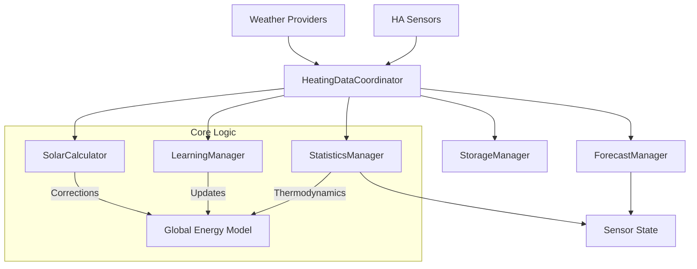

# Heating Analytics Design Documentation

> **Note:** This document outlines the architectural design and logical models of the Heating Analytics integration. It is intended for developers and system architects to understand the *why* and *how* behind the code.

## 1. Architectural Overview

The integration follows a **Coordinator-Manager** pattern to handle complexity and ensure separation of concerns. The system operates on a rigorous thermodynamic model rather than simple linear regression.


```mermaid
graph TD
    Sensors[HA Sensors] --> Coordinator
    Weather[Weather Providers] --> Coordinator

    Coordinator[HeatingDataCoordinator] --> Statistics[StatisticsManager]
    Coordinator --> Forecast[ForecastManager]
    Coordinator --> Learning[LearningManager]
    Coordinator --> Solar[SolarCalculator]
    Coordinator --> Storage[StorageManager]

    Statistics --> Output[Sensor State]
    Forecast --> Output

    subgraph "Core Logic"
    Statistics -- "Thermodynamics" --> Model[Global Energy Model]
    Learning -- "Updates" --> Model
    Solar -- "Corrections" --> Model
    end
```

### Components

1.  **HeatingDataCoordinator (`coordinator.py`):**
    *   **Role:** The Central Nervous System.
    *   **Duty:** Orchestrates the 1-minute update loop, dispatches data to managers, and holds the canonical state (`self.data`).
    *   **Key Behavior:** Handles "Smart Merging" of data gaps (e.g., if HA restarts) using persisted snapshots.

2.  **StatisticsManager (`statistics.py`):**
    *   **Role:** The Physicist.
    *   **Duty:** Calculates thermodynamic power predictions, deviations, and efficiencies.
    *   **Key Innovation:** **Regime-Aware Prediction** (see below). It treats "Cold" days (physics-dominated) differently from "Mild" days (noise-dominated).

3.  **ForecastManager (`forecast.py`):**
    *   **Role:** The Oracle.
    *   **Duty:** Manages future predictions and "What If" scenarios.
    *   **Key Innovation:** **Shadow Forecasting**. It tracks the accuracy of multiple weather sources (Primary vs. Secondary) *simultaneously*, allowing users to validate a new weather provider without switching the active control logic.

4.  **LearningManager (`learning.py`):**
    *   **Role:** The Student.
    *   **Duty:** Updates the energy model based on observed performance.
    *   **Key Behavior:** Uses **Exponential Moving Average (EMA)** to gently adapt the model over time, preventing single-day anomalies from corrupting long-term stats. It also enforces **Purity Guards** (ignoring data during Guest Mode or mixed heating/cooling usage).

5.  **SolarCalculator (`solar.py`):**
    *   **Role:** The Astronomer.
    *   **Duty:** Calculates theoretical solar potential and learns the **Solar Coefficient** (how well the house captures that potential).

6.  **StorageManager (`storage.py`):**
    *   **Role:** The Librarian.
    *   **Duty:** Handles JSON persistence, schema migrations (e.g., HDD -> TDD), and backfilling missing metadata.
    *   **Data Lifecycle:** Manages the promotion of high-resolution `hourly_log` data into aggregated `daily_history` summaries. This ensures that while granular data (logs) is rotated (90 days), the statistical backbone (history) persists indefinitely (2 years).

---

## 2. Core Logic & Models

### A. Thermal Degree Days (TDD)
Unlike traditional systems that split Heating Degree Days (HDD) and Cooling Degree Days (CDD), this system uses a unified **Thermal Degree Day** metric.

*   **Formula:** `TDD = |Balance_Point - Effective_Temperature| / 24`
*   **Why:** A well-insulated house behaves symmetrically: deviation from the balance point requires energy, whether it's heating or cooling. This allows a single continuous model curve.

### B. Inertia & Effective Temperature
Buildings do not react instantly to outside air temperature. The system calculates an **Effective Temperature** using a causal exponential-decay kernel — physically equivalent to the steady-state response of a first-order RC thermal circuit. This value is exposed via the **Thermal State Sensor** for external automations.

*   **Model:** Each hour's outdoor temperature is weighted by `e^(-t/τ)`, where `t` is how many hours ago it was and `τ` (tau) is the user-configured time constant. The most recent hour always carries the highest weight; influence decays monotonically going back in time, never peaking in the middle. The kernel window is `5×τ` hours, which captures ≥ 99 % of the total weight.

*   **Default τ = 4 hours:** Suitable for a typical well-insulated residential building. The effective temperature is a blend of roughly the last 20 hours, with the past 4 hours dominating.

*   **Configurable Profiles (τ values):**
    *   **Fast (τ = 2h):** High responsiveness. Good for poorly insulated structures or lightweight construction.
    *   **Slow (τ = 12h):** Long thermal memory (~60 h window). Good for high thermal mass (concrete, passive house).

*   **Design Rule:** `NEVER` use future data (forecasts) to calculate inertia for the past. This prevents data leakage in the learning model.

### C. Regime-Aware Prediction
The system changes its prediction strategy based on the severity of the weather ("Regimes").

1.  **Cold Regime (TDD > 4.0):**
    *   **Physics Dominates:** Heat loss is linear and predictable.
    *   **Strategy:** If a specific wind/temp bucket is empty, the model uses **Ratio Extrapolation** (`New_Energy = Neighbor_Energy * (New_TDD / Neighbor_TDD)`).
    *   **Constraint:** Strict thermodynamic checks prevent extrapolation from noisy data.

2.  **Mild Regime (TDD <= 4.0):**
    *   **Noise Dominates:** Solar, wind, and internal gains (cooking, people) have a huge relative impact.
    *   **Strategy:** **Nearest Neighbor Averaging**. It prioritizes finding a similar temperature day (+/- 1°C) over trying to scale the energy mathematically. TDD scaling is forbidden here as `0.1 TDD` vs `0.2 TDD` is a 100% math difference but physically irrelevant.

#### Typical Day Normalization
When calculating "Typical Daily Consumption" (Median) for a given temperature, the system applies **Normalization Logic** to ensure all days are comparable.
*   **Old Approach:** Filter out days with Auxiliary usage (discarding data).
*   **New Approach (Normalization):** `Typical = Actual_kWh + Aux_Impact_kWh`.
*   **Why:** This reconstructs what the primary heating system *would have consumed* if the fireplace/heater hadn't been used. This significantly increases the sample size available for statistics, especially in cold weather where auxiliary heat is common.

### D. Solar Modeling (The Kelvin Twist)
Standard solar integration is difficult because "1000W of sun" doesn't mean "1000W of heat" inside. The system employs a sophisticated 3-Zone Geometric Model known as the **Kelvin Twist**:

1.  **Geometric Zones (scalar recommendation path):**
    *   **Direct Zone (+/- 45°):** Full solar gain. The sun is shining directly into the windows.
    *   **Glancing Zone (+/- 90°):** Partial gain. The sun is hitting at an oblique angle, reducing penetration.
    *   **Backside Zone (> 90°):** Zero gain. The sun is behind the building (shadow side).

2.  **Solar Saturation Logic:**
    *   **Thermodynamic Cap:** Solar gain cannot exceed the base heating demand of the house.
    *   **Prevention:** This prevents the model from calculating negative net consumption on sunny winter days, ensuring that "Free Heat" is capped at "Total Heat Needed".

3.  **Decoupled Learning (Normalization):**
    *   The Base Model continues to learn during sunny periods by using **Normalized Energy** (Actual + Estimated Solar).
    *   **Solar Coefficient Learning:** If `Solar_Factor > 0.1`, the system specifically trains the solar coefficients to improve future normalization.

4.  **2D Solar Vector Model:**
    *   The sun's position is decomposed into a **South** (`S`) and **East** (`E`) component using pure geometry — no manual azimuth input required.
    *   Each unit learns a matching 2D coefficient vector `(Coeff_S, Coeff_E)` that captures its effective window orientation and transmittance empirically.
    *   `Unit_Solar_Gain = Coeff_S × Solar_S + Coeff_E × Solar_E`
    *   This dot-product formula means that a south-facing room learns a large `Coeff_S` and near-zero `Coeff_E`, while an east-facing room learns the opposite — without any user configuration.
    *   During cold-start (no learned coefficients yet), an initial scalar default is decomposed along a 180° (south) assumption until real data replaces it.

### E. Auxiliary Heating (Dynamic Coefficients)
For hybrid systems (Heat Pump + Fireplace/Heater), the system does not use a separate "Fireplace Mode" curve. Instead, it learns an **Auxiliary Coefficient**.

*   `Expected_Energy = Base_Model - (Aux_Coefficient * Aux_Duration)`
*   The system learns *how much energy* the auxiliary source saves per minute. This replaces old logic that required a "20% duration threshold" to trigger specific curves.

#### The Kelvin Protocol: Global Authority & Reconciliation
To resolve discrepancies between the Global Model (Top-Down) and the sum of Unit Models (Bottom-Up), the system applies the **Kelvin Protocol Reconciliation**:

1.  **Global Authority:** The Global Model's predicted Aux Reduction is the absolute truth.
2.  **Proportional Scaling:** If the sum of affected unit reductions differs from the Global target (e.g., due to exclusions or model drift), the unit reductions are scaled proportionally so their sum exactly equals the Global target.
3.  **Orphaned Savings:** If global savings cannot be attributed to specific units (e.g., all affected units are off, or list is empty), the savings are tracked as `_accumulated_orphaned_aux`. This ensures that Global Savings are never lost, even if unit attribution is impossible.

> **Note on Reported Savings:** The `accumulated_aux_impact_kwh` sensor strictly reports the **Global Model** value (Total Reduction). The `HeatingPotentialSavingsSensor` breaks this down into `allocated` (Unit Specific) and `unassigned` (Orphaned/Global-Only) savings.

#### Auxiliary Cooldown / Decay Protocol
When auxiliary heating turns off, the building retains heat (thermal mass), causing the heating system to remain idle longer than physics would dictate based on outside temperature. Learning during this "residual heat" period would corrupt the base model (making the house seem magically efficient).

To prevent this, the system implements a **Cooldown State Machine**:

1.  **Trigger:** `auxiliary_heating_active` transitions `True` -> `False`.
2.  **Action:** Learning is **LOCKED** for all units in `aux_affected_entities`.
    *   *Note:* Units NOT in this list continue learning normally (Dual-Track Learning).
3.  **Exit Conditions:**
    *   **Time-out:** `COOLDOWN_MAX_HOURS` (6h) elapsed.
    *   **Convergence:** `Actual_Consumption / Expected_Base > COOLDOWN_CONVERGENCE_THRESHOLD` (95%). This means the heating system has "woken up" and is behaving normally again.

#### Auxiliary Conservation Strategy
When a heating unit is removed from the 'Aux Affected Entities' list (or replaced), its learned auxiliary coefficient (kW reduction) is not lost. The **Conservation Strategy** (`async_migrate_aux_coefficients`) redistributes this coefficient proportionally to the remaining affected units. This preserves the global energy balance—the house doesn't stop saving energy just because you reconfigured a sensor.

### F. Wind Modeling (Bucket Hierarchy)
Wind has a non-linear effect on heating. The system segments wind conditions into three discrete buckets to learn distinct behaviors:

1.  **Normal Wind:** < 5.5 m/s (Light breeze).
2.  **High Wind:** 5.5 - 10.8 m/s (Strong breeze).
3.  **Extreme Wind:** > 10.8 m/s (Storm conditions).

**Fallback Hierarchy:**
To prevent dangerous under-estimation during storms (where data might be sparse), the system enforces a hierarchy:
*   **Direct Fallback:** If *Extreme* data is missing, it looks down to *High*, then *Normal*.
*   **Extrapolation:** When extrapolating from a neighbor temperature (thermodynamic scaling), the system uses the best available wind bucket for that neighbor, prioritizing the requested bucket but accepting *harsher* conditions if necessary to avoid returning zero.

### G. Thermal Mass Correction
The daily energy consumption sent to the `LearningManager` is not always a pure reflection of heat loss — some energy may have been used to heat the building mass itself, or the mass may have released stored heat. Without correcting for this, the U-model would learn incorrectly on days with indoor temperature fluctuations.

To solve this, the system calculates a correction once per day before the U-update:

`delta_kwh = thermal_mass_kwh_per_degree * (T_indoor_end - T_indoor_start)`
`adjusted_consumption = measured_consumption - delta_kwh`

- **Rising Indoor Temp:** Heat was bound in the mass. We add it back to the consumption.
- **Falling Indoor Temp:** Mass provided "free" heat. We subtract it.

The user configures `thermal_mass_kwh_per_degree` (electric kWh/°C) using a rule of thumb based on area and an assumed average COP. Because we only have raw electrical kWh and no dynamic COP curve, a fixed factor is the most pragmatic solution. The error is non-systematic (some days over, some under) and averages out in the long-term U-estimate. Setting this to `0.0` disables the correction.

### H. Daily Learning Mode

The primary learning system (Track A) updates the detailed `temp_key × wind_bucket` correlation table every hour. However, hourly learning is unsuitable for some homes:

- **High thermal mass:** Concrete/stone buildings store heat across many hours. An hourly observation window captures too much lag noise for reliable learning.
- **High minimum modulation:** Heat pumps with a high floor on output power cycle on and off at the minimum rate, making any single hour an unreliable sample.

For these cases, the user can enable **Daily Learning Mode** (`daily_learning_mode = True` in config) to activate **Track B** as the exclusive update path.

**When active:**
- Track A is completely blocked from writing to `_correlation_data`. Track B owns the correlation table exclusively.
- Learning fires once per day at midnight, after `_process_daily_data()` has assembled the full day's statistics.
- **Completeness Guard:** Requires at least **22 of 24 hours** to be present in the day log before any update is applied (raised from 20 in v1.2.7).
- **Diagnostic Output:** A dedicated sensor (`heating_analytics_daily_learning`) exposes the learned U-Coefficient (kWh/TDD/day) as its state. This allows for long-term tracking of the building's overall thermal health independent of specific temperature buckets.

**Inputs:**
1. Total measured consumption for the day (`daily_stats["kwh"]`)
2. Total TDD for the day (`daily_stats["tdd"]`)
3. ΔT_indoor (T_indoor at midnight − T_indoor at the previous midnight) — **optional**, only applied when `indoor_temp_sensor` is configured and the readings are available at both midnight boundaries.

**Process:**
If the indoor temperature correction is active, measured consumption is adjusted before use:
`q_adjusted = daily_kwh − (thermal_mass_kWh_per_°C × ΔT_indoor)`

The system then calculates an observed average hourly consumption and writes it into the bucket for the day's (temp, wind) pair using the same EMA formula as Track A, at the user's configured `learning_rate`:
- Cold start: `bucket = q_adjusted / 24`
- Subsequent: `bucket = bucket + learning_rate × (q_adjusted/24 − bucket)`

In parallel, a single global **U-Coefficient** (kWh_el / TDD / day) is updated via EMA at `DEFAULT_DAILY_LEARNING_RATE` (a lower, fixed rate) for long-term drift tracking. This value is exposed by the **Daily Learning diagnostic sensor** (`heating_analytics_daily_learning`) together with `last_midnight_indoor_temp`, `thermal_mass_kwh_per_degree`, `indoor_temp_sensor`, and `learning_rate` as attributes.

**Purity Guards:** Days with Guest Mode, mixed-mode auxiliary usage (20–80%), or active Cooldown are excluded from Track B learning, identical to Track A's guards.

**Indoor temperature sensor:** The sensor is always optional, even in Daily Learning Mode. Users who do not load-shift but still benefit from daily aggregation (due to high thermal mass or minimum modulation) can enable the mode without providing an indoor sensor — thermal mass correction is simply skipped.

**The Data Resolution Trade-off (Diurnal Collapse):**

While Track B resolves the load-shifting and thermal mass phase-shift problems of Track A, it introduces a severe penalty to learning rate across the temperature spectrum.

Track A exploits the natural diurnal temperature swing: a day ranging from 4°C at night to 14°C at noon will populate up to 10 distinct temperature buckets in a single 24-hour period, delivering a broad, well-sampled slice of the heating curve every day.

Track B mathematically collapses this entire swing into a single daily average (e.g., 9°C), yielding one data point per day regardless of the day's thermal range. To populate the bucket for deep-winter conditions (e.g., −10°C), the model must wait for a calendar day whose 24-hour mean reaches −10°C — an event that may occur only a handful of times per season, compared to the many individual overnight hours that reach that temperature under Track A.

In practice this means:
- **Track A:** The heating curve is broadly characterised within 2–4 weeks of varied weather.
- **Track B:** Full characterisation of the heating curve may require an entire heating season.

Track B should therefore be strictly reserved for setups where the underlying building physics — significant load shifting or very high concrete/stone thermal mass — render hourly observations thermodynamically invalid as individual learning samples.

### I. Thermodynamic Reconstruction
When reconstructing historical data (e.g., for model comparison), the system prioritizes **Hourly Vectors** (see Section 5). If vectors are missing (legacy data), it performs **Thermodynamic Reconstruction**:

*   It recovers the **Effective Temperature** from the stored TDD value.
*   `Temp_Effective = Balance_Point - (TDD * 24)`
*   This ensures that even scalar historical data respects the thermodynamic conditions under which it was recorded, allowing for accurate re-simulation even if original logs are lost.

---

## 3. The Forecasting Engine

### A. Blended Forecast Strategy
To maximize both short-term precision and long-term stability, the system implements a **Blended Forecast Strategy** that combines two weather providers.

1.  **Primary Provider:** (e.g., Local Sensor or Met.no) Used for the immediate future (Days 1 to X). Provides high-resolution, local accuracy.
2.  **Secondary Provider:** (e.g., Open-Meteo) Used for the long-term (Days X+1 to 7). Provides stable, consistent trends where local sensors might drift or fail.
3.  **Crossover Point:** Configurable via `Forecast Crossover Day`.

### B. Provenance Tracking (Accuracy Attribution)
When mixing weather sources, it is critical to know *who* is responsible for a prediction error. The system logs **Provenance Metadata** for every hourly prediction:

*   **`primary_entity` & `secondary_entity`:** The entity IDs of the providers active at the time of prediction.
*   **`crossover_day`:** The crossover configuration used at prediction time.
*   **`source`:** Which specific provider was used for *that specific hour* (Primary or Secondary).

**Why?** When calculating accuracy statistics, the system filters history by `primary_entity` / `secondary_entity` and only includes entries where the recorded entity matches the *currently configured* entity. This prevents "Cross-Contamination"—e.g., if you switch from AccuWeather to Open-Meteo, the system will not attribute AccuWeather's past errors to Open-Meteo.

### C. Shadow Forecasting & Per-Source Accuracy Metrics
The system ingests forecasts from *both* sources simultaneously, regardless of which one is active for the blended output:

1.  **Active:** The Blended Forecast described above (Primary for days 1–X, Secondary for days X+1–7).
2.  **Shadow:** Energy predictions are generated for *both* Primary and Secondary across the full horizon in parallel.

At the end of each day, both predictions are compared against actual consumption and stored in forecast history with full provenance metadata. This enables independent, contamination-free accuracy statistics per source.

**Exposed attribute:** `forecast_accuracy_by_source` (on the Weather Plan Today sensor) reports the following metrics for each source (`primary` / `secondary`):

#### Energy Accuracy (kWh/day)

| Field | Definition |
|---|---|
| `mae_7d` | Mean Absolute Error over the last 7 days. Computed as the average of \|net daily error\| per day, where the daily error is the signed sum of hourly energy errors (kWh). Measures day-level accuracy. |
| `mape_7d` | MAE expressed as a percentage of actual daily consumption. `(Σ\|daily_net_error\| / Σactual_kWh) × 100`. Scale-independent accuracy indicator. |
| `mae_30d` | Same as `mae_7d` but over a 30-day rolling window. Provides a stable long-term baseline. |
| `mape_30d` | Same as `mape_7d` over 30 days. |

The daily net error is the *algebraic sum* of signed hourly errors within a day before taking absolute value. This deliberately ignores intra-day timing errors (e.g., a forecast that is +2 kWh in the morning and −2 kWh in the afternoon cancels to zero), which would otherwise penalize forecasters for temperature curves shifting a few hours, not for actual energy misjudgment.

#### Temperature Accuracy (°C, net daily deviation)

| Field | Definition |
|---|---|
| `weather_mae_7d` | Mean of \|net daily temperature error\| over 7 days. The daily temperature error is the signed sum of hourly (forecast_temp − actual_temp) differences for that day. Positive = forecaster ran too warm; negative = too cold. |
| `weather_bias_7d` | Mean of the *signed* net daily temperature error over 7 days. A persistent non-zero bias indicates a systematic warm or cold offset in the weather source for this location. |
| `weather_mae_30d` | Same as `weather_mae_7d` over 30 days. |
| `weather_bias_30d` | Same as `weather_bias_7d` over 30 days. |

**Role in blend logic:** `weather_mae` and `weather_bias` are the primary inputs used internally to rank and select the better weather source before the crossover decision is applied. They are temperature-domain metrics (°C), not energy-domain metrics, and are therefore more sensitive to systematic forecast drift than `mae_7d`. They are exposed in the attribute for transparency and diagnostics, not as end-user KPIs.

### D. Hybrid Projection ("The Funnel")
The "Energy Forecast Today" sensor does not just show the morning forecast. It implements a **Hybrid Projection** that converges to reality.

*   `Forecast_Today = (Actual_kWh_So_Far) + (Predicted_kWh_Remaining)`
*   **At 00:00:** 100% Prediction.
*   **At 12:00:** 50% Fact, 50% Prediction.
*   **At 23:59:** 100% Fact.
*   **Why:** This eliminates the frustration of seeing a "10kWh" forecast at 8 PM when you've already burned 15kWh.

This **Hybrid Approach** is also used for multi-day period comparisons (`compare_periods`):
*   **Past Days:** Historical Logs (`daily_history`).
*   **Today:** Hybrid (`energy_today` + `calculate_future_energy`).
*   **Future Days:** Pure Forecast (`get_future_day_prediction`).

### E. Reference vs. Live (Budget vs. Reality)
*   **Reference Forecast ("The Budget"):** Frozen at 00:00 (Midnight Snapshot).
    *   **Goal:** Stability. This is the plan we agreed on at the start of the day.
    *   **Use Case:** Baseline for deviations. If weather changes, the deviation shows *why* consumption changed.
    *   **Source:** `source='reference'` in `ForecastManager`.

*   **Live Forecast ("Thermodynamic Projection"):** Updated hourly.
    *   **Goal:** Reality. "Where are we actually heading?"
    *   **Composition:** `Actuals So Far` + `Live Forecast for Remaining Hours`.
    *   **Use Case:** `thermodynamic_projection_kwh` attribute. This is what you will likely pay at the end of the day.
    *   **Source:** `source='live'` in `ForecastManager`.

---

## 4. Learning & Data Flow

### The Learning Loop (Hourly)
At the top of every hour, the system:
1.  **Validates:** Is data complete? Is the "Guest Switch" off?
2.  **Normalizes:** Removes estimated Solar and Auxiliary impact from the actual consumption to find the "Pure Thermal Base".
3.  **Updates:** Feeds this Pure Base into the model using **EMA (Exponential Moving Average)**.
    *   `New_Model_Value = (Old_Value * (1 - Rate)) + (New_Observation * Rate)`
    *   **Rate:** Typically 0.01 (1%). This makes the model "sticky" and resistant to outliers.

### Jump-Start Mechanism
To prevent slow convergence on new installations:
1.  **Buffering:** The system buffers the first 4 samples for any new Temperature/Wind bucket.
2.  **Injection:** Once the buffer is full, it calculates the average and "Jump Starts" the model value directly to this average, bypassing the slow EMA warmup.
3.  **Result:** Useable predictions appear within hours, not weeks.

### DHW Mode — Air-to-Water Heat Pump Hysteresis

Air-to-water heat pumps periodically switch from space-heating to producing domestic hot water (DHW). During a DHW cycle the compressor runs at full power, but all energy is diverted to the hot-water tank — zero heat is delivered to the space. The building cools slightly, and the subsequent space-heating phase must compensate for the lost time.

This is physically identical to a thermostat-hysteresis cycle on a direct-electric heating cable:

| Phase | Heating cable | Air-to-water HP |
|---|---|---|
| Active | Delivers P_heat until thermostat setpoint | Space-heating |
| Pause | Hysteresis cutoff, no heat to space | DHW cycle, no space heat |

In both cases the space-heating model observes an inflated reading during the active phase:

```
obs_active = TRUE_B × (t_active + t_pause) / t_active   [cycle-ratio inflation]
obs_pause  = 0
```

#### Strategy A — Skip (old `MODE_OFF` behaviour, incorrect for DHW)

If DHW hours are simply skipped (no model update), the EMA converges to `obs_active`, not `TRUE_B`. This produces permanent upward drift proportional to the DHW duty cycle:

| DHW scenario | Duty cycle | Coefficient drift |
|---|---|---|
| Light (1 h DHW / 11 h heat) | 8% | +9% |
| Medium (2 h DHW / 6 h heat) | 25% | +33% |
| Heavy (2 h DHW / 4 h heat) | 33% | +50% |
| Standby (14 h DHW / 10 h heat) | 58% | +140% |

#### Strategy B — Observe Zero (`MODE_DHW`, current behaviour, correct)

Setting a unit to `MODE_DHW` causes the model to update with `actual = 0` during DHW hours — the physically correct observation (zero space-heat contribution). The EMA converges to `TRUE_B` at all learning rates. No drift.

**Sampling Precision:** Starting in v1.2.7, the exclusion logic is applied during a 2-minute accumulation tick (evaluating the state 30 times per hour). This ensures that mid-hour mode switches (e.g., a 10-minute shower at 14:45) are tracked with high temporal resolution, preventing DHW energy from bleeding into the hourly heating total.

#### Oscillation Amplitude and Learning Rate

Strategy B eliminates mean drift but introduces a within-cycle oscillation: the coefficient is pulled toward `obs_active` during heating and toward 0 during DHW. The amplitude grows with learning rate. Analytically simulated steady-state amplitudes (half peak-to-peak as % of TRUE_B, stability criterion ≤ ±10%):

| Scenario | LR 1% | LR 2% | LR 3% |
|---|---|---|---|
| DHW light (8% ratio) | ±0.1% ✓ | ±0.2% ✓ | ±0.3% ✓ |
| DHW medium (25% ratio) | ±0.4% ✓ | ±0.8% ✓ | ±1.2% ✓ |
| DHW heavy (33% ratio) | ±1.0% ✓ | ±2.0% ✓ | ±3.0% ✓ |
| DHW standby (58% ratio) | ±7.0% ✓ | ±14% borderline | ±21% ✗ |

The default global learning rate (1%) remains within the stability threshold even in the most extreme DHW standby scenario. Learning rates above 2–3% are not recommended for installations with high DHW duty cycles.

#### Interaction with Aux Learning

If `is_aux_active` and `unit_mode == MODE_DHW` are simultaneously true, aux-coefficient learning is skipped for that unit. The zero space-heat contribution is caused by the DHW cycle, not the aux system — attributing it to aux would corrupt the per-unit aux coefficient.

### Guest Mode & Purity Guards
The "Guest Mode" is a critical feature for model integrity.
*   **Problem:** Guests crank the heat to 25°C, ruining the "Normal" model for the homeowner (21°C).
*   **Solution:** When Guest Mode is active, the system **stops learning**. It tracks usage for billing/stats ("Guest Impact"), but the underlying thermodynamic model remains untouched.

### Seamless Rolling Efficiency
To avoid the "Midnight Jump" (where efficiency `kWh/TDD` goes to infinity because TDD is 0), the system uses a dynamic window.
*   **Logic:** If `TDD_Today < 0.5`, it borrows data from Yesterday to fill the denominator.
*   **Result:** Efficiency lines are smooth across midnight boundaries.

---

## 5. Persistence & Storage Strategy

To protect the user's hardware (specifically SD cards on Raspberry Pi), the integration implements a **Low-Frequency Write Strategy**:

1.  **Buffer First:** High-frequency sensor data is aggregated in memory (RAM).
2.  **Hourly Flush:** Data is written to disk (`.storage/heating_analytics`) only **once per hour**, or immediately upon system shutdown/restart.
3.  **Crash Recovery:** In the event of a power loss or ungraceful shutdown (where RAM buffer is lost), the **Gap Handling Logic** uses cumulative sensor counters to mathematically reconstruct the total consumption during the downtime.

### Hourly Vectors (High-Fidelity History)
Previously, the system stored daily averages (Avg Temp, Total kWh). This caused 'aliasing' errors where a cold morning + warm afternoon averaged to a mild day, losing the thermodynamic context of the heating spikes.

The system now stores **Hourly Vectors** in the daily history: arrays of 24 hourly values for Temperature, Wind, TDD, and Actual Load.
*   **Structure:** `{ "temp": [v0..v23], "load": [v0..v23], ... }`
*   **Benefit:** Enables precise 'What-If' re-simulations and accurate model updates even years later, as the specific conditions for every hour are preserved.

---

## 6. Sensor Architecture & Logic

This section details the calculation logic for key sensors, clarifying the distinction between "Gross Thermodynamic Demand" (what the house needs) and "Net Electrical Load" (what the meter sees).

### A. Model Comparison Sensors
The Comparison Sensors (`Day`, `Week`, `Month`) answer the question: *"Are we using more energy than normal?"*

They operate on a **Dual-Layer Architecture**:

1.  **State (Primary): Weather-Normalized Comparison**
    *   **Logic:** `Model(Current_Weather) - Model(Reference_Weather)`
    *   **Purpose:** Isolates weather impact (Climatic Delta).
    *   **Explanation:** Calculates the theoretical energy difference driven purely by weather conditions compared to last year. If positive, the weather is forcing higher consumption. If negative, the weather is helping us save.

2.  **Attributes (Secondary): Real-World Comparison**
    *   **Logic:** `Hybrid_Total_Current - Actual_Total_Last_Year`
    *   **Purpose:** Shows the raw billing impact ("What will I pay?").
    *   **Hybrid Calculation:** `Past_Actuals + Today_Budget(Actual+Forecast) + Future_Forecast`.

### B. Thermal Stress Index (Expected Energy Sensor)
The `Energy Baseline Today` sensor calculates the **Thermal Stress Index**, defined as:
*   **Formula:** `(Gross_Thermodynamic_Forecast / Max_Historical_Load) * 100`
*   **Gross vs. Net:** This calculation uses the **Gross Forecast** (i.e., total heat demand *before* any auxiliary heating reduction).
*   **Why:** If you run a fireplace (Aux) on the coldest day of the year, your *electrical* load might be low, but the *thermal stress* on the building is Extreme. Using Gross Demand prevents the "Mild Weather Fallacy," ensuring the system correctly reports that the house is fighting hard against the cold.

### C. Potential Savings (Auxiliary Sensor)
The `AUX Savings Today` sensor quantifies the benefit of auxiliary heat sources (e.g., fireplace, diesel heater).

1.  **Theoretical Max:** The projected savings for the *entire day*.
    *   `Max_Savings = Global_Model_Base(24h) - Global_Model_Aux(24h)`
    *   This projection combines completed hours (cache) with future hours (forecast).
2.  **Live Status (Power Allocation):**
    *   The sensor attributes break down the current instantaneous power (kW) into:
        *   **Allocated:** Useful heat replacing electrical load.
        *   **Unassigned (Overflow):** Heat generated in excess of the model's demand (clamped).
    *   **Mean Power Calculation:** `(Accumulated_kWh / Minutes_Passed) * 60`. This transforms energy integrators into live power gauges for UI dashboards.

---

## 7. Design Principles (Kelvin Protocol)

These principles guide all development on this integration:

1.  **Thermodynamic Validity:** Never produce a result that violates physics (e.g., negative TDD, COP > 10).
2.  **Temporal Stability:**
    *   No linear projections from early data (e.g., don't multiply 1am usage by 24).
    *   No hard logic jumps based on time of day.
3.  **Fail-Forward:** If a sensor fails, the system falls back to the best available estimate (e.g., Reference Forecast -> Semantic Average -> 0), rather than crashing.
4.  **Metric-Driven Development:** Optimization tasks are prioritized by `Value = (Impact × Urgency) / Effort`.

### A. The Feed-Forward Mandate (Analytics vs. Control)

Heating Analytics is strictly a **Feed-Forward Analysis Engine**. It is architecturally prohibited from performing direct closed-loop control (e.g., writing setpoints or triggering relays).

- **Reason 1 — Feedback Loop Corruption:** If the model controls the heating that produces the data it learns from, the training signal becomes a function of the model's own decisions. This leads to *Model Drift*, where the system learns its own behaviour rather than the building's thermodynamics.
- **Reason 2 — Subjective Comfort:** Control requires subjective trade-offs between cost and comfort. This integration provides the Ground Truth (the physics), allowing the user to build their own "Moral" layer (automations) on top of it.
- **Implementation:** All outputs are provided as diagnostic sensors or service responses (`get_forecast`), intended as inputs for external logic (EMHASS, Node-RED, or standard HA Automations).

---

## 8. Known Limitations

### Thermal Hysteresis After Deep Cold Spells

The model treats identical outdoor temperatures as thermodynamically equivalent, regardless of the thermal history that preceded them. In practice, a house at +2 °C after a week below −10 °C behaves very differently from a house at +2 °C after cooling down from a mild period.

**Root causes:**

-   **Deep thermal mass lag.** Foundations and structural elements have a thermal time constant of days to weeks, not hours. After a deep cold spell they continue acting as a heat sink well after outdoor air has warmed, drawing energy from the heating system invisibly to the 4-hour inertia window.
-   **Heat pump COP history.** During the cold spell the heat pump operated in its least efficient zone (low COP, frequent defrost cycles). This accumulated thermal debt is not captured in any current model variable.
-   **Direction-agnostic inertia model.** The exponential decay kernel (τ = 4 h by default) represents only the shallow, fast thermal mass (indoor air, wall surfaces). The same kernel is used regardless of whether temperatures are rising or falling — warming from cold and cooling from warm are treated as mirror images of the same physical process, which they are not.

**Observed symptom:** After a deep cold spell the model consistently *underestimates* actual heat demand during the recovery phase. Conversely, when temperatures drop from a mild baseline the model tends to *overestimate* demand at the same outdoor temperatures. The asymmetry is most pronounced near +1 °C to +3 °C.

**Why it is not fixed:** A correct remedy would require either a multi-day thermal state variable (e.g., an exponentially smoothed 48–72 h temperature integrator) or asymmetric inertia coefficients conditioned on the direction of thermal travel. Both approaches introduce meaningful implementation complexity, require sufficient historical data to calibrate, and carry a real risk of making predictions worse in the statistically dominant case (normal, non-extreme temperature transitions) in order to improve them in the rare case (transition out of a deep cold spell, which occurs only a handful of times per winter season). The current pragmatic decision is to accept this limitation and document it here rather than risk destabilising the model's everyday accuracy.
